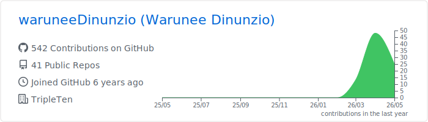
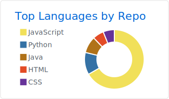
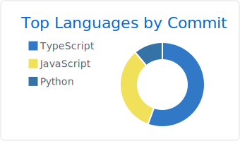
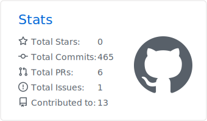

### Hello, folks! 

# I'm Warunee Dinunzio

  

---

### 🎯 About Me

I’m a detail-oriented QA Automation Engineer with hands-on experience in  
**Python, Selenium, Pytest, API testing, and Playwright with TypeScript**.

I’m currently contributing to an externship where I test a **web application with AI-powered features** using **Playwright + TypeScript**, focusing on building reliable and scalable automation.

**💡 Impact:** Designed and executed automated end-to-end tests, improving test reliability and helping identify critical bugs early in development.

I care deeply about **software quality, accessibility, and real-world impact**.

---

## 🚀 Featured Project
<table>
<tr>
<td width="100%" style="background-color:#161B22">
  
### 🤖 Local AI Chatbot QA Automation

<a href="https://github.com/waruneeDinunzio/Local_AI_chatbot_QA_automation">
  View Repository →
</a>
  

A full-stack AI chatbot and QA automation project where I built a local LLM-powered chatbot with Ollama and developed Playwright end-to-end tests to validate real-world AI interactions, asynchronous UI behavior, API responses, and error handling.

### 🔍 What This Project Demonstrates

✅ Design of scalable QA automation frameworks  
✅ Testing AI-driven user workflows  
✅ Validation of asynchronous UI behavior  
✅ Mocking API responses for stable test execution  
✅ Real integration testing with a local AI model  
✅ Playwright best practices (POM, locators, fixtures)  
✅ End-to-end testing of AI-powered applications

</td>
</tr>
</table>

---

## 🧰 Tech Stack

### Languages

### QA & Automation

### Web & Tools

---
### 📊 GitHub Stats

<!---->

---

## 🧪 What I Bring

✔️ Automation testing with **Playwright, Selenium & Pytest**  
✔️ Building and maintaining scalable test frameworks  
✔️ Writing clear, maintainable, and reliable test cases  
✔️ Strong attention to detail & bug tracking  
✔️ Accessibility-focused testing inspired by real-world needs  
✔️ Experience testing AI-powered user workflows  
✔️ Fast learner with a growth mindset

### 🤝 Open to Opportunities

I’m actively seeking **QA Automation Engineer roles**
and opportunities to contribute to **mission-driven teams**.

---

### 📫 Let’s Connect

📧 **Email:** dinunziow@gmail.com  

💼 **LinkedIn:** https://www.linkedin.com/in/warunee-dinunzio/

---

## ⚡ Fun Facts

♟ I enjoy playing chess  

🏃‍♀️ Training for a half marathon  

🌱 Passionate about sustainability, accessibility, and lifelong learning

### 🐲 Bonus Fun Fact

🤔 True or False: I named my son "Jira" after the bug tracking tool because I love QA so much?

---

#### ❌ False!

Plot twist 😄

I actually named my son **Jira** after... **GoJira (Godzilla)** — THE KING of MONSTERS 🐲

#### 😅 Well... not exactly!

The real story...

Jira, the bug tracking tool, was named after **Gojira (Godzilla)**.

My son Jira’s name actually comes from the first two letters of my nickname and my husband’s name — and it’s also a Thai name.

So somehow, completely by accident...

I still ended up working with Jira every day as a QA Engineer.

Life has a great sense of humor like that 😄

